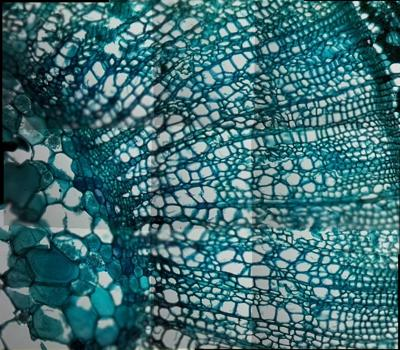

# yosegi-scope

Automated assembly of microscopy mosaics captured by the
[OpenFlexure microscope](https://openflexure.org/).

As the scope scans a sample it produces a series of overlapping image patches.
`yosegi-scope` fetches those tiles from the microscope over the local network,
aligns them, and merges them into a single seamless composite — no manual
stitching required.

The longer-term goal is a self-driving digital-pathology pipeline: the microscope
**finds the tissue and surveys only the tissue automatically**, the scan is cleaned
with **image post-processing**, a model performs **brightfield → fluorescence**
translation, and the whole thing is exposed as an **API** behind a web **front
end**. See the [Roadmap](#roadmap).

> **Status:** the automatic whole-slide survey works end-to-end. `yosegi run
> --auto` captures a coarse overview, detects **every tissue region** on it, plans
> a **tissue-gated** high-resolution scan that **skips the empty slide** between
> and around the sections, runs that scan, and stitches the final mosaic — no
> manually specified grid required. The manual `acquire` and `stitch` commands are
> unchanged.



*A 3×3 scan acquired and stitched by `yosegi run` (stained plant-stem section).
Tiles are placed from the scope's affine calibration and refined by correlation,
so the cell structure stays continuous across seams.*

## How it works

- **Acquire** — [`openflexure-microscope-client`](https://pypi.org/project/openflexure-microscope-client/)
  drives the scope (mDNS/IP discovery, stage moves, autofocus, capture) to raster
  an XY grid of overlapping tiles.
- **Stitch** — uses [`openflexure-stitching`](https://gitlab.com/openflexure/openflexure-stitching),
  the official OpenFlexure tool. `acquire` embeds each tile's **stage position** and
  the scope's **camera-stage-mapping (CSM) affine matrix** in EXIF; the stitcher
  places tiles by `stage × affine` (correctly handling the camera's rotation and
  scaling) and refines with high-pass phase correlation + a least-squares global
  optimisation. `--no-correlate` does stage+affine placement only, which is reliable
  on faint samples where correlation can't connect tiles.
- **Survey (`--auto`)** — coarse overview pass, then classical tissue
  segmentation (no ML) that unions three cues: **saturation** (stained tissue is
  coloured while glass is near-grey — the digital-pathology standard),
  **intensity** (Otsu; tissue is darker), and **texture** (local variance; tissue
  is textured). Every tissue region is detected — a slide with several sections is
  fully surveyed — and the high-resolution snake scan is **tissue-gated**: a tile
  is captured only if its centre falls on tissue, so the empty slide between
  regions is skipped. Then execute and stitch. No manual `--rows`/`--cols`
  required.
- **Focus map (`--focus-map`)** — autofocus at a few in-tissue points per region,
  fit a Z(x, y) plane, and set each tile's focus from that surface instead of
  re-focusing at every tile. Faster and steadier on a tilted slide.
- **Post-process** *(next)* — standard techniques to make the composite cleaner and
  more accurate: flat-field / illumination correction to remove vignetting, seam
  exposure blending so tile edges disappear, white balance / contrast
  normalisation, and optional denoising and background flattening.

## Requirements

- Python **3.11** (pinned: some pinned dependency wheels are unavailable on 3.12).
- [`uv`](https://docs.astral.sh/uv/) for environment and dependency management.
- **libvips** — a native library `openflexure-stitching` needs:
  `brew install vips` (macOS) or `sudo apt-get install libvips` (Debian/Ubuntu).
  On macOS, if stitching fails to load libvips, prefix commands with
  `DYLD_FALLBACK_LIBRARY_PATH=$(brew --prefix)/lib`.

## Install

```bash
uv sync
```

## Usage

```bash
# Show all commands
uv run yosegi --help

# Scan a 3x3 grid and save overlapping tiles (2000 stage steps between tiles)
uv run yosegi acquire --host microscope.local --output ./tiles \
    --rows 3 --cols 3 --step-x 2000 --step-y 2000

# Autofocus runs at every tile by default; pass --no-autofocus to skip it
uv run yosegi acquire --host microscope.local --output ./tiles --no-autofocus

# Stitch a folder of tiles into one composite (stage+affine placement + correlation)
uv run yosegi stitch --input ./tiles --output mosaic.jpg

# Stage+affine placement only (reliable on faint/low-texture samples)
uv run yosegi stitch --input ./tiles --output mosaic.jpg --no-correlate

# Acquire then stitch in one pass
uv run yosegi run --host microscope.local --output mosaic.jpg

# Automatic whole-slide survey: find every tissue region, scan only the tissue
uv run yosegi run --auto --host microscope.local --output mosaic.jpg \
    --overview-rows 5 --overview-cols 5 \
    --overview-step-x 2500 --overview-step-y 2500

# Survey only the largest tissue region (skip smaller sections / debris)
uv run yosegi run --auto --host microscope.local --output mosaic.jpg --max-regions 1

# Use a per-region focus map instead of autofocusing at every tile (tilted slides)
uv run yosegi run --auto --host microscope.local --output mosaic.jpg --focus-map
```

With `--auto`, the coarse overview lands in `mosaic_overview/` (+ a stitched
`mosaic_overview.jpg`) and the tissue-gated high-resolution tiles in
`mosaic_tiles/` — a sparse, densely-renumbered set, fewer than a full grid when
the tissue is patchy. `--min-area-frac` sets the smallest region (as a fraction
of the overview) that counts as tissue rather than a speck.

If `--host` is omitted, the microscope is discovered automatically via mDNS.

The stage moves `--step-x`/`--step-y` **stage steps** between adjacent tiles, in a
snake pattern, autofocuses at each tile (disable with `--no-autofocus`), and returns
to the start when done. The right step size depends on your objective and sample —
pick a value that leaves the desired overlap between neighbouring tiles. Before
scanning, `acquire` reads the scope's **camera-stage-mapping** calibration (running
it once if absent) and writes each tile's stage position and that affine matrix into
EXIF, which is what the stitcher uses to place tiles. `--overlap` is recorded as
metadata only.

## Development

```bash
uv run pytest        # tests
uv run ruff check    # lint
```

## Roadmap

Done:

- [x] Acquisition raster (XY grid, autofocus, capture) — `acquire.py`.
- [x] Stitching via `openflexure-stitching` (EXIF stage coords + CSM affine matrix).
- [x] CI (ruff + pytest).
- [x] **Multi-region tissue detection** in `survey.py` — `detect_sample_regions`
  (saturation ∪ intensity ∪ texture cues → all tissue regions, not just one),
  with `detect_sample_bbox` kept as a single-bbox convenience wrapper.
- [x] **Tissue-gated scan planning** — `plan_survey` rasters a snake grid over the
  detected tissue and keeps only tiles whose centre lands on tissue, skipping the
  empty slide (`plan_tile_grid` remains for a dense grid).
- [x] **Automatic whole-slide survey end-to-end** behind `yosegi run --auto` —
  coarse overview, detect every region, plan the tissue-gated scan, run it, stitch.
- [x] **Per-region focus map** (`focus.py`, `run --auto --focus-map`) — autofocus at
  a few in-tissue points per region, fit a Z(x, y) plane, and set each tile's focus
  from that surface instead of re-focusing at every tile.

**Now — post-processing.** Standard techniques to clean the stitched composite:
flat-field / illumination correction, seam exposure blending, white-balance and
contrast normalisation, optional denoising. Goal: no visible tile seams or
vignetting.

Planned, in order:

1. **Brightfield → fluorescence.** A deep-learning model performs virtual staining /
   modality translation from the brightfield mosaic to a fluorescence-like image,
   surfacing structure that brightfield alone doesn't show.
2. **API.** Wrap acquisition, stitching, post-processing, survey, and inference behind
   a typed service (FastAPI + Pydantic models) so the pipeline can be driven
   programmatically and remotely.
3. **Front end.** A web UI on top of the API to launch scans, watch progress, and
   browse/zoom the resulting mosaics.

## License

GPL-3.0-or-later. See [LICENSE](LICENSE).
